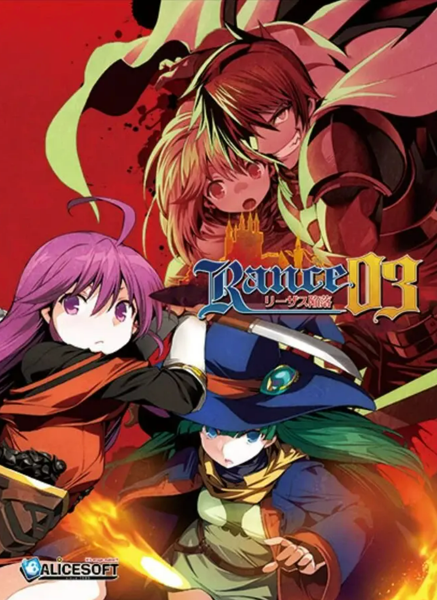

<figure style="width: 300px; margin: 0 auto; text-align: center;">
  
  <figcaption style="margin-top: 5px; font-style: italic;">
    图 1：Rance 03 封面
  </figcaption>
</figure>

时隔三年，终于开始重新回顾兰斯系列了。我个人是从来不喜欢走回头路的，奈何兰斯的世界观体系太过出色，内容太过丰富，乃至于玩完后对其他所有异世界风格的作品都提不起兴趣，同时最近陷入了大四的自我怀疑阶段，因此开始重温大一时游玩的经典之作。计划是先玩03，然后是兰斯9（个人最喜欢的一部），兰斯10，兰斯7。不玩兰斯6的原因是实在受不了那个逆天3D迷宫，当年玩的晕头转向，每半小时必须休息一会。此外前两天刚刚把兰斯10的贤者人物和小象使徒收下（终于），最近每天都在疯狂的读各类设定，堪称痴迷。因此开始写这些早就说过要写却总是被遗忘的游玩感想。

标题把这一作称为无暇之作可能有点言过其实，但该作实在是继承了兰斯系列所有的优点而几乎很难找到缺点。简洁有趣的战斗设计，鱼介最后的超神画风（我实在欣赏不来多娜的原画），精彩而完善的剧情，几乎完美的氛围渲染，特色鲜明的人物塑造，以及把他和其他系列作品区别开的最重要的一点：极其高质量的配音。这些要素综合起来几乎能让其他作品都黯然失色。诚然其还没到可以称作神作的地步，但也不妨碍我认为其是一部六边形的几乎完美的作品。重温这作时最直观的感受就是“玩起来特别舒服”。

先说配音，由于这是兰斯系列唯一一部有配音的作品，这部里的声音印象其实就是全系列的人物印象。在这部留下了配音的角色几乎都能给人深刻的印象。除了志津香的声音有点扁平化外，加奈美，玛利亚，赛尔，卡奥斯，希露，美莉乃至魔人诺斯和艾泽鲁，都是能一直回味到全系列完结的高质量搭配。最为突出的大概就是加奈美，游戏中的Kanami配音完美还原了想象中笨蛋忍者的形象。毫无疑问，这一作的配音虽然是系列孤例，但已经在业界作品中能达到上游水准。

然后是原画。我不得不说这一作是我心目中鱼介最后的巅峰，毕竟多娜的画风我实在欣赏不来。这一作的希露（R10的狮子头我tm……）、加奈美、玛利亚和志津香立绘都是我心目中系列最佳。其中也包括很多令人回味无穷的CG，比如开头绝美的莉亚求救，中间很多高质量的配角Hcg，加奈美在恶魔回廊的异世界play，超神级别的战斗场景（以赛尔封印萨特拉为首，赛尔酱好帅）。同时很多原画背景、人物细节也值得称道。这些内容可能嘴上说说没什么感觉，有待各位亲自去品鉴。

接下来谈谈游戏的剧情。在这部游戏里你会看见一个很有趣的现象，我将其称为“伏笔反演”。简单来说就是，由于该作是比R9还要晚的前作完全重制版，作者可以在里面埋下很多呼应“时间上后续作品”的伏笔。实际上当年的Rance3（你能对一部90年代的作品要求什么呢？）是不可能有如此厚重的体量和内容的，而经历了二十余年的沉淀，新出品的Rance03有了比当初更完整的世界观背景，更丰富的人物性格（哪怕这是由Rance456789决定的），更有待发掘的深度内容。举两个无关大局的例子，R03的后日谈里，阿莉斯接到了实际上R8才出现的粉丝（一个小偶像）的来信；游乐园园长被R10才出现的足球军师表白（足球？要素察觉）。这两个我认为是典型的Rance系列的伏笔反演。实际上，对于新游玩的玩家来说，他们意味不到这是“后来设定好的伏笔”，如果你玩到R8还记得这个名字，你会感受到Rance系列里时空跨越的沧桑和厚重感。而如果你是像我一样重温的玩家，你则会感叹：原来当年的R03里，他们就已经有了踪影。再比如像废弃都市的梦想之环，他上承接R2/R02的菲露指环，下为R8阿姆的污染人类埋下伏笔，堪称伏笔反演的典范（虽然我们无法得知拉吉西斯和菲露是怎么整出如此强大的指环的，那可是魔法LV3，或许是早期力量设定的太随意了？）。在此之外，由于后续作品的补充量，使得R03的魔人、魔王故事更加引人入胜，你会不由自主的陷入其中，为战胜魔人而奉献自己的现实生活里的大把时间。

有一说一，就在刚刚写完上一段点评的时候，抽空去研究了一下菲露指环和梦想之环的联系（借助我最近最爱的Alicesoft Wiki），这种由词条衍生出新词条不断阅读设定的感觉真的很迷人。

接下来谈谈R10的剧情塑造。故事起源于加奈美受莉亚之托去找兰斯救国。从这一刻开始标志着兰斯系列的剧情不再是之前的小打小闹，救救女孩子或是探索小镇的秘密，而是上升到了国家乃至世界级的纷争，这是体量上质的变化。我承认小的体量也能写出封神级别的作品，然而大体量作品的史诗感和震撼感是小品作永远提供不了的。期间经历了各类事件，先是由冒险为开端，再是解放自由都市，然后反攻利萨斯，最后血战诺斯和姬尔。整个过程一气呵成，虽然也有很多支线剧情，但是让人完全目不暇接，整个游戏流程充满紧凑感，没有丝毫凑数的感觉。当年初体验的时候（还是高考完的暑假），我在一开始的冒险探索阶段还很悠闲，甚至在到一个阶段后停了下来，一直到大一上学期的中期才开始重温，然而紧接着的战斗/战争剧情便一发不可收拾。最终一口气通关乃至那个学期接下来的时间里都在疯狂的沉迷兰斯系列。由于前文提到的伏笔反演和世界观的补充，本作的节奏设定几乎完美，同时对于刚接触这个系列的人来说，对上魔人的压迫感和窒息感几乎是透过屏幕扑面而来的。这表明A社塑造了一个十分成功的，实力差距悬殊的，对于人类来说几乎可以说是绝望的完整的人-神-魔体系。当然，对于神的解读还要到R8才能浮出水面，但对于魔人与魔王的塑造，R03可称得上经典。此外，对于战争表现，R03也展现出了不同于别作的水准。R6前期小组织小打小闹，后期打魔军表现力不足（个人认为人类打魔军的战役表现力远远不如人类对战，除非把鬼畜王战争拉出来好好做个外传），R7主打玩家个人操作，R9的强袭作战从客观来看实在稍显离谱，R10同样是打魔军。而R03是正儿八经的人类大战，期间完美体现了兰斯“永远乱来却有效”的风格，对战争的描写同样堪称精彩。

让我们说说R10的人物塑造。这一作无论是主角还是配角都能够给人留下不俗的水准。主角自不提，我个人观点里，配角塑造最好的是托马和诺斯。先来说说托马。在整个赫尔曼势力里，最令人尊敬的无疑是托马，他可以满足一个男人对于铁血军人所有的想象。游戏中的托马沉着冷静，处变不惊，身先士卒，军纪严明，同时在深陷绝境之时表现出了令人感动的豪迈与爱国之情。其为巴顿觉醒而献身的决定亦是我对其尊敬的原因。可以说，如果没有托马，就没有后续巴顿的蜕变，没有R9令人感动的革命故事（为了赫尔曼！）。正是因为托马之死在兰斯03给人留下的深刻印象，才能让玩家对R9的故事有更深一层的感触。再说诺斯。作为一个魔人，他足智多谋（这是其他奇葩魔人不具备的，点名批评低能荷铁头），隐忍，强大而卑鄙。几乎可以说是一个完美的反派角色。卧薪尝胆复活魔王的剧情让所有人都倒吸一口凉气，而从诺斯复活魔王到守门这一段几乎可以说是全作最具有压迫感的剧情。当然，对于这两个角色，配音也立了大功。实际上R03的老头配音都不错。此外本作还有初登场的利克（帅利克），活泼的天才科学家玛利亚（比后期的老太婆形象强太多），令人感慨的洒脱的战士米莉等等优秀的角色形象，在此不一一赘述。

最后，R03的系统也堪称经典。其战斗和地牢设计可以说是我个人认为全作除了R10以外的最佳（我个人极度偏爱R10的战斗模式和开箱子）。相较于类似的R01,战斗方式更为简洁，地牢设计也更为合理，包括道具的使用，技能的选择，这些虽然称不上完美，也可以说是精品了。这也是能让我玩的下去的重要因素之一（再次点名批评R6的垃圾迷宫垃圾垃圾垃圾垃圾垃圾）。

然后是一些个人的吐槽。

先说明一下，在兰斯世界里，能力等级可以分成LV0,1,2,3。其中0级别是普通人能达到的经验丰富的水准，1级别是对于很有天赋的人能达到的优秀水准，2级别可以说是该领域顶尖的人才，而3级别则是超乎想象的，甚至可以说是因果律能力的超级水准，拥有LV3能力的人基本可以看作是人类最强（或者说世界最强）的有力人选。

首先不得不提的是，作为魔法3，汉蒂在这一作的表现简直是灾难。实际上我完全看不出汉蒂除了因为她无限寿命所以可以瞬移以外比其他魔法3战斗力强在哪里。几乎可以说是被诺斯暴打，费尽心机设置的圣魔封印也被随手就破掉了。想想剑3的藤原石丸起码也是和查埃比尔打的昏天黑地，一系列斗神都可以大战魔人，在诺斯面前只能仓皇逃跑的汉蒂属实拉胯。

利萨斯方面最为遗憾的大概是几个R01女主虽然回归了却没有CG，实在可惜，而且后续她们也不会出现了，可怜奈美，米莉，帕蒂这几个在R10里连卡都没有（我的米莉，悲，本来是大有可为的不知道幸运几的体质）。

对于赫尔曼军方面，其实还是挺想看亨德森变身后的实力的然而就连官方都没给出到底会是啥样的。然后其中的兰德斯塔兄长我感觉甚至其实比大多数人都靠谱，可惜被塑造成了一个完全的搞笑角色，后续也没机会看到他了，至于他妹妹纯坑比。

自由都市这边，求人票给的巴林古完全是个废物（真的烂还老是被替补抬上来）。另外诺亚这个名字刚看到的时候就挺难绷的，不过R10里回收了这个伏笔也还挺好，虽然从人物设定上有点牵强。莲歧的双重人格设定就这样浪费掉其实还有点可惜（毕竟是钦定的除了盖伊以外唯一双重人格）。废弃都市那没有详细展开废弃人类剧情还是有点遗憾的。

魔人侧最想说的还是萨特拉的剧情，一个是赛尔那段封印实在是又燃又帅，另一个凯撒和伊西斯救主也挺感人且精彩的，可惜后续伊西斯没有复活（我严重怀疑是A社偷懒，按道理萨特拉应该有办法也会想办法去复活他）。艾泽鲁则是纯纯的大啥比，优点就只有长得帅声音好听了，其他一无是处。不过后续到底死没死也是未解之谜了。另外有一个bug：在打诺斯的时候，不需要卡奥斯破防也能直接造城市伤害，个人感觉是a社压根没想起来这件事，但无伤大雅。

由于是最后才推出的重制版，主人公侧的鬼畜剧情可以说已经是大大减少了。实际上在这一部兰斯除了对路人做了很多出生事情外，几个女主可以说已经是向纯爱向发展了。譬如志津香和加奈美，这二者实际上在这作里的态度相较后续几作要更亲和一点（虽然可能很难发现）。包括希露，本作救希露的剧情可以说是最佳片段之一了。

最后，兰斯03可以说是一部精彩的，几乎没有瑕疵的优秀之作。作为一部重制版，它完美的带给了新手玩家们最佳的入坑体验，同时也让回顾的老玩家们能够找到很多当年的感动。虽然他并没有在某一方面做到极致封神的地步，在我的心中地位也不如R9和R10，但它的高质量配得上成为兰斯系列的顶梁柱和入坑的敲门砖。也不知道天国的R4和R5还能不能重制。（其实最该重制的是R6，好好做下那个迷宫比什么都强）

最后的最后，感谢观看本文，如果您没有玩过R3或是刚刚入坑，希望这篇随笔能帮您更好的体验游戏，如果您是老手，希望这篇随笔能引起您的共鸣。

终于把老早就埋下的坑填上了，接下来玩的几部应该也会这样点评一下，还请期待吧。